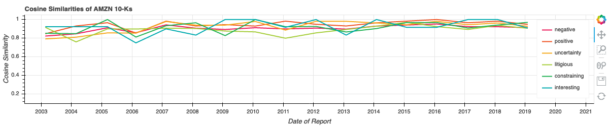
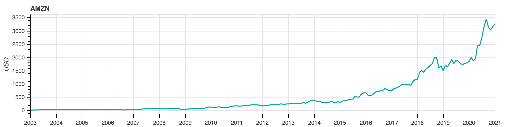
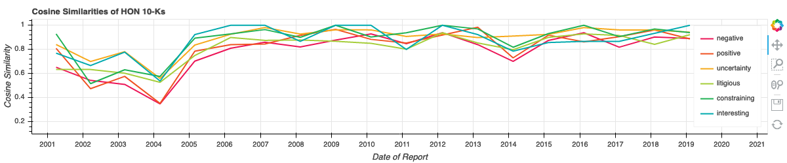
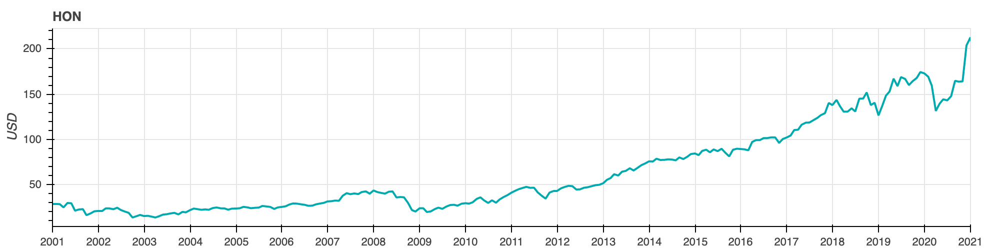
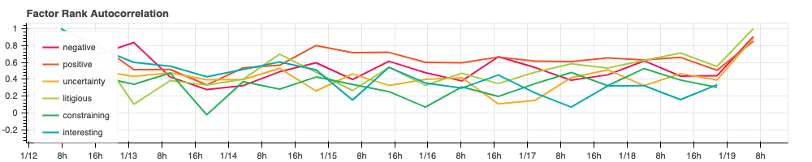

# NLP Financial Statements
**view code: [NLPFinancialStatements.ipynb](NLPFinancialStatements.ipynb)**

NLP analysis of 10-Ks from a hand-full of companies. A Form 10-K is an annual report required by the U.S. Securities and Exchange Commission, that gives a comprehensive summary of a company's financial performance. A firm's active change in their reporting practices is an important signal about future firm operations. By measuring the 10-K similarities from one year to the next, we can generate an alpha factor. This methodology was introduced in a paper called _Lazy Prices_.

Build a TFIDF with each category from _Loghran-McDonald Sentiment Word List_ as the vocabulary from each 10-K, then measure the cosine similarity of a 10-K from one year to the next per company.

The cosine similarity from year to year is the factor ran against yearly pricing data of each stock. The price data came from [Alpha Vantage](https://www.alphavantage.co).










The ```alphalens``` library calculates the forward returns to determine the validity of the proposed factors.

Without doing a full and formal backtest, we can analyze how stable the alphas are over time. Stability in this sense means that from period to period, the alpha ranks do not change much. Since trading is costly, we always prefer, all other things being equal, that the ranks do not change significantly per period. We can measure this with the Factor Rank Autocorrelation (FRA).



Finally viewing the sharpe ratio will inform which factors are acceptable. A sharpe ratio at or above one for a single alpha factor is acceptable for this universe.

```python
negative       -1.48
positive       -3.12
uncertainty    -4.91
litigious       0.94
constraining    3.86
interesting     4.46
```
